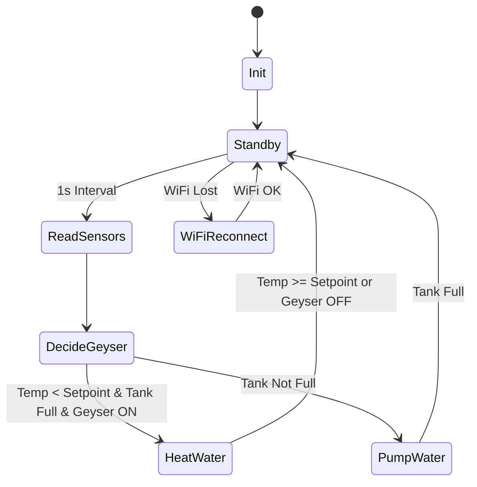

# IoT-Based Geyser Automation and Energy Monitoring System

## Abstract

This project presents a fully integrated IoT-based smart geyser and energy management system designed for efficient water heating, power and safety monitoring, and remote control. SGEMS combines an ESP32 microcontroller with multiple sensors (water level, temperature, voltage, and current), solid-state relays, and feedback indicators to manage water heating, tank fill/empty cycles, and real-time energy metering. The system interacts with the Blynk cloud for remote configuration, notifications, usage history, and alerting. Featuring an LCD dashboard for instant feedback, the solution prioritizes safety, efficiency, automation, and user convenience. Use cases include homes, smart buildings, and energy-aware water heating deployment.

---

## Hardware Components

- **ESP32** (WiFi microcontroller, main logic)
- **Voltage Sensor** (ZMPT101B)
- **Current Sensor** (ACS712/EmonLib)
- **Solid-State Relay**
- **12V DC Power Supply** (for peripherals)
- **Water Level Sensor**
- **DS18B20 Temperature Sensor** (Dallas)
- **Pump Relay & Submersible Pump**
- **Heating Element/Heater**
- **Buzzer & Notification LEDs**
- **I2C 16x4 LCD Display**

---

## Features

- Automatic geyser temperature control via cloud/mobile
- Remote/manual water tank fill/pump control
- Live water temperature and level indication
- Energy monitoring (Voltage, Current, Load, Consumption)
- Safety: notifications for critical levels/temperatures
- Advanced LCD dashboard, customizable icons
- EEPROM-based energy usage history (power-failure protection)
- Extensible for more sensors and actuators

---

## Software Structure

- `main.ino`: Core control (sensors, relays, LCD, Blynk, logic, notifications)
- Uses: Blynk library (ESP32), LiquidCrystal_I2C, DallasTemperature, OneWire, EmonLib, ZMPT101B, Preferences

---

```mermaid
## UML Class Diagram

classDiagram
class ESP32 {
+setup()
+loop()
+run_Tasks()
+lcd_Dashboard()
+check_Voltage()
+check_current()
+temperatureCheck()
+waterLevelCheck()
+geyserFunction()
+pumpFunction()
+heaterOnTime()
+LedNotification()
}
class VoltageSensor {
+getRmsVoltage()
}
class CurrentSensor {
+calcIrms()
}
class WaterLevelSensor {
+analogRead()
}
class DS18B20 {
+requestTemperatures()
+getTempCByIndex()
}
class BlynkCloud {
+run()
+virtualWrite()
+syncVirtual()
+logEvent()
}
ESP32 --> VoltageSensor
ESP32 --> CurrentSensor
ESP32 --> WaterLevelSensor
ESP32 --> DS18B20
ESP32 --> BlynkCloud
```

---

## Flowchart

```mermaid
flowchart TD
A[System Startup] --> B[Hardware & LCD Init]
B --> C[WiFi & Blynk Connect]
C --> D[Main Loop: run_Tasks()]
D --> E{Timer Interval}
E -->|1 sec| F[Read Sensors: Voltage, Current, Temp, Water Level]
F --> G[Check Geyser Function & Pump]
G --> H[Update Relays, LEDs, Blynk, LCD]
H --> D
```

---

## State Diagram



---

## File Descriptions

| File/Folder           | Description                                       |
|-----------------------|---------------------------------------------------|
| main.ino              | Main firmware code                                |
| /Schematic            | Schematic			                                    |

---

## License

MIT License

---

*For further improvements: integrate solar input, AI-driven scheduling, web dashboard, or advanced predictive alerts!*
